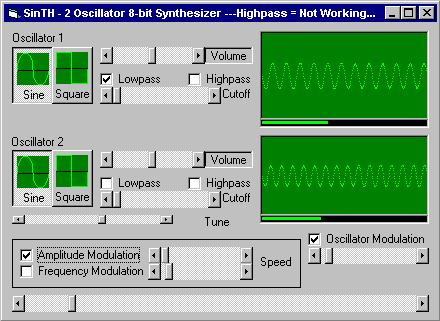



## Synthesizer

### Description

2 Oscillator Synthesizer. Each Oscillator can produce a SINE and a SQUARE waveform. Lowpass Filter and beginings to a Highpass Filter included. Also has amplitude modulation, frequency modulation (buggy), and another modulator that mixes between the two oscillators (like a cross fade). YOU MUST HAVE DIRECTX7!!!
 
### More Info
 
Warps fragile minds.

             |
---                |---
**Submitted On**   |2000-04-05 14:06:24
**By**             |[Dave Katrowski](https://github.com/Planet-Source-Code/PSCIndex/blob/master/ByAuthor/dave-katrowski.md)
**Level**          |Advanced
**User Rating**    |4.4 (44 globes from 10 users)
**Compatibility**  |VB 5\.0, VB 6\.0
**Category**       |[DirectX](https://github.com/Planet-Source-Code/PSCIndex/blob/master/ByCategory/directx__1-44.md)
**World**          |[Visual Basic](https://github.com/Planet-Source-Code/PSCIndex/blob/master/ByWorld/visual-basic.md)
**Archive File**   |[CODE\_UPLOAD4565462000\.zip](https://github.com/Planet-Source-Code/dave-katrowski-synthesizer__1-7052/archive/master.zip)

